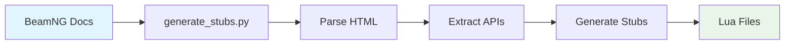

<div align="center">

# 🚗 BeamNG.drive Lua API Stubs

<p align="center">
  <strong>Supercharge your BeamNG.drive mod development with comprehensive Lua API stubs</strong>
</p>

<p align="center">
  <a href="#-features">Features</a> •
  <a href="#-quick-start">Quick Start</a> •
  <a href="#-usage">Usage</a> •
  <a href="#-api-reference">API Reference</a> •
  <a href="#-contributing">Contributing</a>
</p>

<p align="center">
  
  
  
  
</p>

<p align="center">
  
  
</p>

</div>

---

## 🎯 Overview

Transform your BeamNG.drive modding experience with **comprehensive, auto-generated Lua API stubs** that provide intelligent code completion, type checking, and documentation right in your IDE. No more guessing function signatures or hunting through documentation!

## ✨ Features

<table>
<tr>
<td>

🎯 **Complete API Coverage**

- Engine-level APIs
- Vehicle-level APIs
- Core utilities & helpers
- 1000+ documented functions

</td>
<td>

🔍 **Smart Type Annotations**

- Lua Language Server compatible
- Parameter type hints
- Return value documentation
- Error-free development

</td>
</tr>
<tr>
<td>

📁 **Organized Structure**

- Logical API categorization
- Namespace-based organization
- Easy navigation & discovery
- Clean, readable code

</td>
<td>

🛠️ **IDE Integration**

- VS Code ready
- IntelliJ/CLion support
- Any LSP-compatible editor
- Zero configuration needed

</td>
</tr>
</table>

## 🚀 Quick Start

### 1️⃣ Clone the Repository

```bash
git clone https://github.com/aethyriion/beamng-lua-stubs.git
cd beamng-lua-stubs
```

### 2️⃣ Configure Your IDE

<details>
<summary><b>🔵 VS Code Setup</b></summary>

1. Install the [Lua Language Server extension](https://marketplace.visualstudio.com/items?itemName=sumneko.lua)
2. Add to your `.vscode/settings.json`:

```json
{
    "Lua.workspace.library": [
        "path/to/beamng-lua-stubs/stubs"
    ],
    "Lua.diagnostics.globals": [
        "Engine", "BeamNG", "Sim", "FS", "be", "obj", "v",
        "playerInfo", "damageTracker", "energyStorage", "ai", "extensions"
    ]
}
```

</details>

<details>
<summary><b>🟠 IntelliJ IDEA / CLion Setup</b></summary>

1. Install the Lua plugin
2. Add the stubs directory as a library in project settings
3. Configure Lua SDK to recognize BeamNG globals

</details>

### 3️⃣ Start Coding

```lua
-- Enjoy full autocompletion and type checking! 🎉
local raycast = Engine.castRay(startPos, endPos, true, false)
local soundId = Engine.Audio.createSource('AudioGui', 'event:>UI>Click')
```

## 📚 API Reference

<details>
<summary><b>🔧 Engine APIs</b> <code>stubs/engine/</code></summary>

| File | Description |
|------|-------------|
| `engine.lua` | Core engine functions (physics, rendering, etc.) |
| `beamengine.lua` | BeamEngine specific functions |
| `sim.lua` | Simulation and object management |
| `engine_audio.lua` | Audio system functions |
| `engine_debug.lua` | Debug and logging functions |
| `engine_online.lua` | Online/multiplayer functions |
| `engine_platform.lua` | Platform-specific functions |

</details>

<details>
<summary><b>🚗 Vehicle APIs</b> <code>stubs/vehicle/</code></summary>

| File | Description |
|------|-------------|
| `vehicle.lua` | Vehicle-specific functions |
| `controller.lua` | Vehicle controller functions |
| `globals.lua` | Common vehicle globals (be, obj, v, playerInfo, etc.) |
| `ai.lua` | AI system for autonomous driving |
| `energystorage.lua` | Energy storage system (fuel tanks, batteries) |

</details>

<details>
<summary><b>⚙️ Core APIs</b> <code>stubs/core/</code></summary>

| File | Description |
|------|-------------|
| `global.lua` | Global utility functions |
| `fs.lua` | File system functions |
| `loadingmanager.lua` | Asset loading functions |

</details>

## 💡 Usage Examples

### 🎮 Engine Functions

```lua
-- Physics & Rendering
local raycast = Engine.castRay(startPos, endPos, true, false)
local vehicleId = BeamEngine.spawnObject('vehicles/etk800', nil, spawnPos)

-- Audio System
local soundId = Engine.Audio.createSource('AudioGui', 'event:>UI>Click')
Engine.Audio.playOnce(soundId)
```

### 🚗 Vehicle Development

```lua
-- Damage System
damageTracker.setDamage("engine", "radiatorLeak", true)

-- Energy Management
energyStorage.getStorage('mainTank'):setRemainingRatio(1)

-- AI Behavior
ai.setTarget("targetID", "chase")
ai.setSpeedMode("off")

-- Vehicle Data Access
local nodeCount = #v.data.nodes
local playerSeated = playerInfo.seated
```

### 🔧 Advanced Integration

```lua
-- Complex mod integration with full IDE support
local ModuleManager = {
    modules = {},

    registerModule = function(self, name, module)
        -- Full autocompletion for BeamNG APIs
        Engine.log('I', 'ModuleManager', 'Registering module: ' .. name)
        self.modules[name] = module

        -- Type-safe vehicle operations
        if module.vehicleInit then
            be.queueObjectLua(obj:getID(), 'module.vehicleInit()')
        end
    end
}
```

## 🔄 Generation Process

<div align="center">



</div>

### 🛠️ Regenerate Stubs

```bash
python3 generate_stubs.py "List of BeamNG Functions and Fields.html" "List of BeamNG Functions and Fields_vehicles.html"
```

### 📊 Project Statistics

<div align="center">

| Metric | Count |
|--------|-------|
| 📁 **Namespaces** | 69 |
| ⚡ **Functions** | 1,005+ |
| 🎯 **API Coverage** | Engine + Vehicle + Core |
| 📝 **Generated Files** | 100+ |

</div>

## 🤝 Contributing

We welcome contributions from the BeamNG modding community! Here's how you can help:

<details>
<summary><b>🐛 Found a Bug?</b></summary>

1. Check if the issue already exists in [Issues](https://github.com/aethyriion/beamng-lua-stubs/issues)
2. Create a detailed bug report with:
   - Expected vs actual behavior
   - Code snippet demonstrating the issue
   - Your IDE and extension versions

</details>

<details>
<summary><b>💡 Want to Improve the Generator?</b></summary>

1. Fork this repository
2. Make your changes to `generate_stubs.py`
3. Test with: `python3 generate_stubs.py [html_files...]`
4. Submit a pull request with a clear description

</details>

<details>
<summary><b>📖 Documentation Improvements</b></summary>

- Fix typos or unclear explanations
- Add more usage examples
- Improve setup instructions
- Enhance API documentation

</details>

### 🎯 Contribution Guidelines

- Follow existing code style and patterns
- Test your changes thoroughly
- Update documentation as needed
- Be respectful and constructive in discussions

## 📄 License

<div align="center">

**MIT License** - See [LICENSE](LICENSE) for details

*This project is open source and free to use for any purpose, including commercial projects.*

</div>

### 🔒 Legal Notice

These stubs are generated from publicly available BeamNG.drive documentation and are provided for development convenience. Please respect BeamNG's terms of service when using these for mod development.

## ⚠️ Disclaimer

> **Note**: These stubs are automatically generated and may not be 100% accurate. Always refer to the official BeamNG documentation for authoritative API information.

---

<div align="center">

**Made with ❤️ by the BeamNG modding community**

[⭐ Star this repo](https://github.com/aethyriion/beamng-lua-stubs) • [🐛 Report Issues](https://github.com/aethyriion/beamng-lua-stubs/issues) • [💬 Discussions](https://github.com/aethyriion/beamng-lua-stubs/discussions)

</div>
